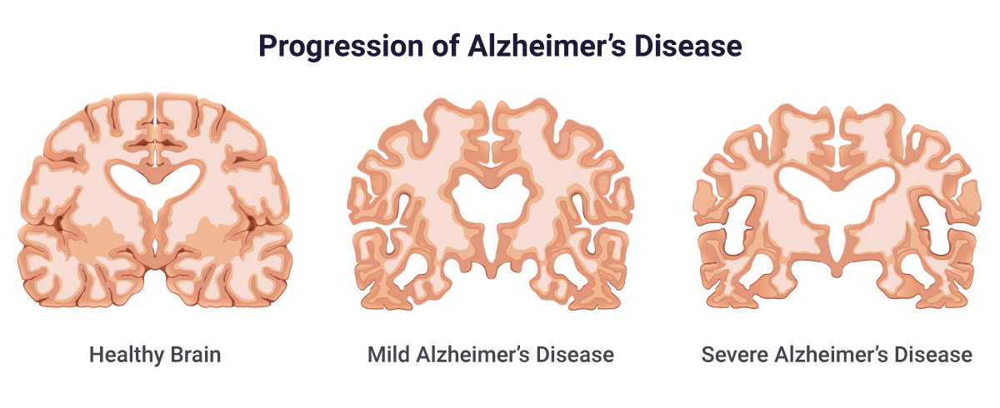
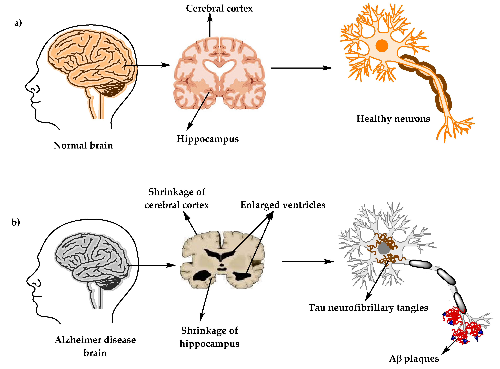

# Early stage detection of Alzheimer's Disease
Early detection of Alzheimer's disease can be possible through the successful classification of brain MRI images of the first four stages of the disease.

**This project includes :**  
• Fine-tuning & Deployment of multiple convolutional networks (VGG16, Xception, DenseNet201) for the classification of brain MRI images.  

<i>Tools : TensorFlow/Keras, Matplotlib</i>

# Problem Overview - Alzheimer's
*References :*  
data-set : https://www.kaggle.com/datasets/tourist55/alzheimers-dataset-4-class-of-images  
The 7 stages of Alzheimer's: https://www.seniorguidance.org/senior-living/stages-of-dementia-and-alzheimers-disease/

## Alzheimer's disease
Alzheimer's disease is a progressive disease, where the symptoms of dementia gradually worsen over several years. In its early stages, memory loss is mild, but as the stages of Alzheimer's progress, individuals lose the ability to hold a conversation and react to their environment.
Current treatments for Alzheimer's disease cannot prevent Alzheimer's disease from progressing, they can only temporarily slow the worsening of dementia symptoms and improve the quality of life for people with Alzheimer's disease. and their caregivers.

Alzheimer's disease goes through many stages, which we can categorize as follows:
1. **Non Demented** - There are usually no signs or symptoms that the disease is present.
2. **Very Mild Demented** - Life can go on as normal at this point, with the exception of occasional mild memory loss.
3. **Mild Demented** - **~7 years** - Performance on cognitive and memory tests are affected, and doctors can instantly identify impaired cognitive function.
4. **Moderate Demented** - **~2 years** - Symptoms of dementia are clear at this stage, loved ones can help with daily tasks and ensure the patient is safe at any time.

The other stages of the disease are the clearest and therefore do not require detection by MRI, these stages are:

5. **Moderately Severe dementia** - **~1.5 years** - Patients begin to need help with many activities of daily living.
6. **Severely Demented** - **2.5 years** - Patients may require constant 24/7 supervision, some will experience hallucinations or paranoia and have difficulty falling asleep.
7. **Extremely Severe Demented** - Dementia is terminal, they may not have much longer to live. Patients lose their motor skills, their ability to communicate, and their ability to react to the environment

*Note: The 7 stages of dementia are not in neat and precise boxes. Some patients may experience the symptoms shown while others may differ slightly or even significantly.*

## Causes of Alzheimer's
Researchers have found that subtle changes occur in the brain long before the first signs of Alzheimer's disease-related memory loss appear, **brain damage begins a decade or more** before its effects become apparent.

Abnormal levels of **beta-amyloid**, a natural protein, build up in the brain and form **plaques between nerve cells**. Another naturally occurring protein, **tau**, accumulates inside nerve cells and creates **neurofibrillar tangles**, or twisted fibers. These toxic buildups of protein **prevent nerve cells, or neurons, from transmitting information** as they otherwise would. So they lose their connections to other nerve cells and **die over time**.

Brain damage linked to Alzheimer's disease appears to begin in the **hippocampus**, which is the area of ​​the brain responsible for forming memories. As the disease progresses, other areas of the brain are also affected and **begin to shrink**. 
In the final stage of the disease, the damage is extensive and **brain tissue has shrunk dramatically**.

## Alzheimer's early detection
Using **Magnetic Resonance Imaging (MRI)** scans & Deep Learning, we have the ability to identify and quantify the reduction of certain regions in the brain, enabling us to detect the subtle alterations that occur well in advance of the initial indications of memory loss associated with Alzheimer's disease. This can improve the likelihood of successful treatment.